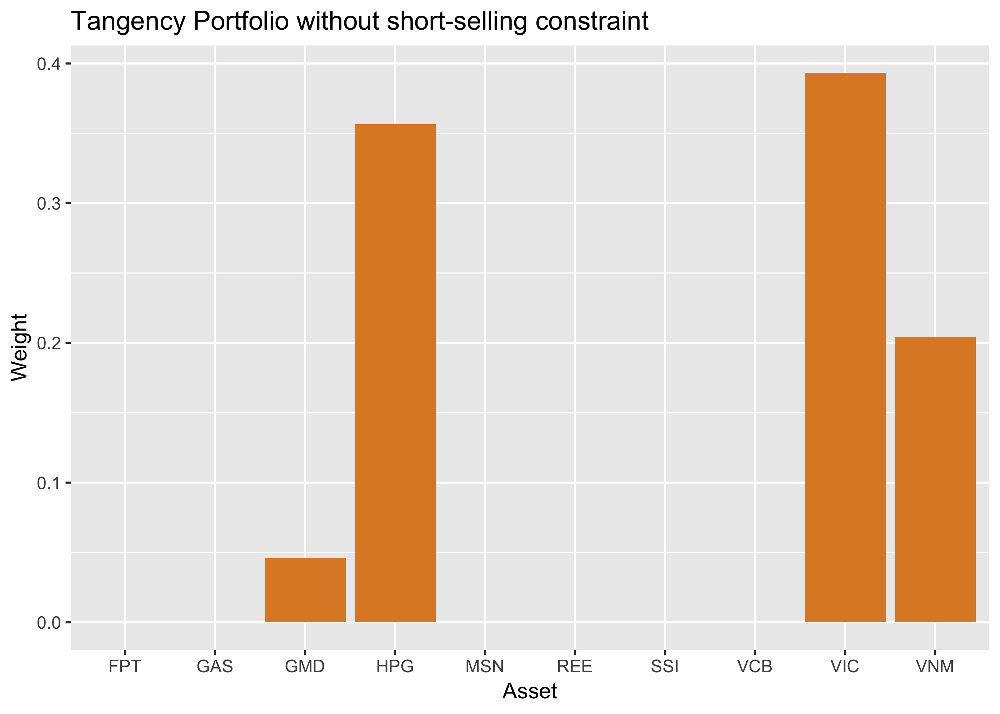
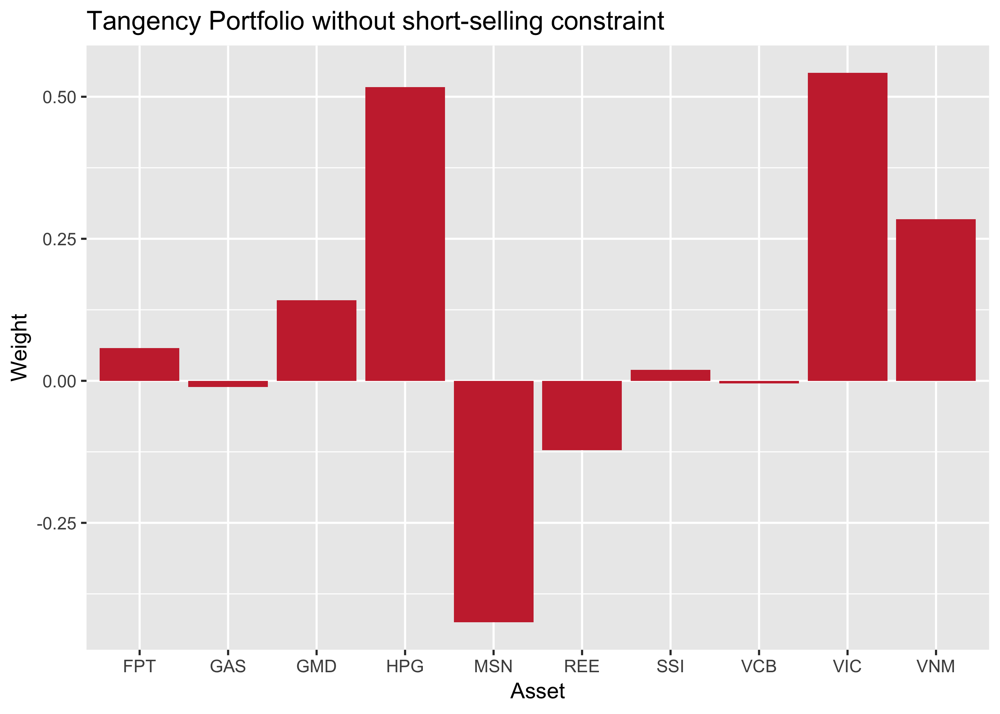
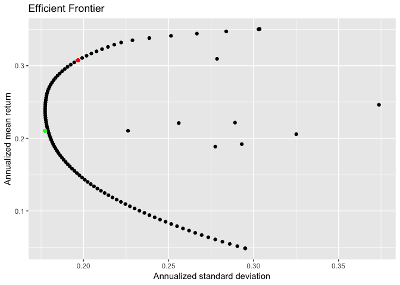
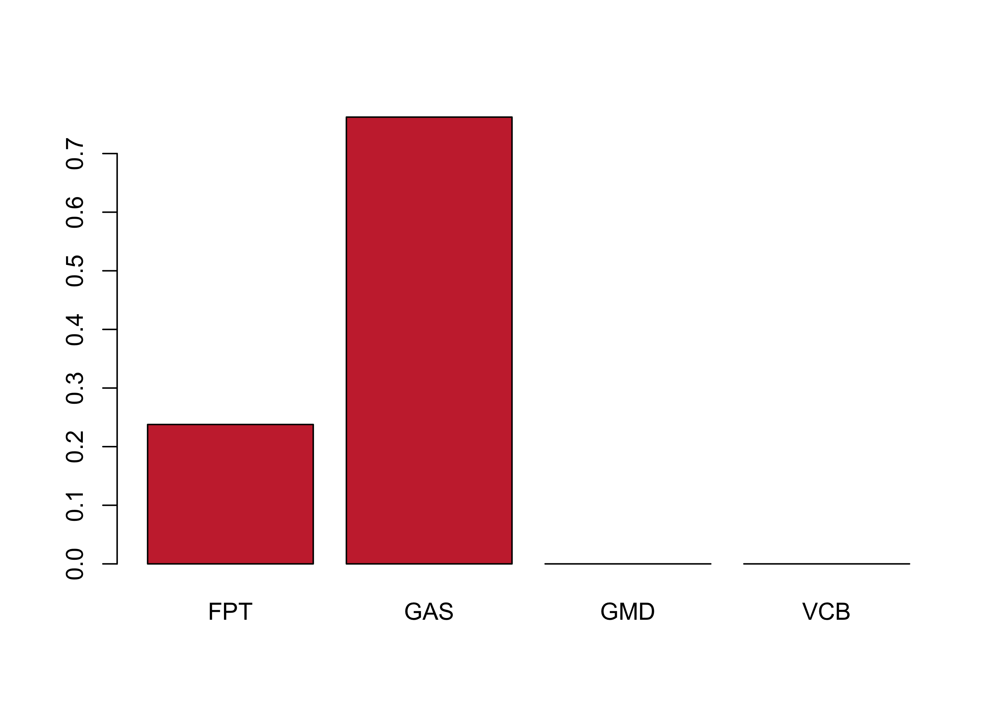

<!-- README.md is generated from README.Rmd. Please edit that file -->

# quantport

The package `quantport` provides routines to perform portfolio
optimization based on quadratic and sequential programming. With Sharpe
Ratio maximization problem (tangency portfolio), the lower boundary and
upper boundary for any single asset, as well as other constraints could
be implemented using Sequential Programming.

The main advantage of this package is easy-to-use and simplicity. The
package is based purely on functional programming. You do not need to
create object like S3 or S4 to run portfolio optimization. The result
from optimization will be stored in dataframe or list only. The mean
vector and the covariance matrix could be used from daily, monthly or
quarterly data. The package could be used in complement with your master
studies in portfolio optimization or courses such as CFA, FRM, etc.

# Plan for development

In the near future, we will add further functionalities including
Differential Evolutionary Optimization (DE) and Canonical
Black-Litterman model.

# Installation

There are several packages required: `quadprog`, `DEoptim`, `NlcOptim`,
`ggplot2` and `tidyverse`. We plan to submit this package to
[CRAN](https://CRAN.R-project.org) in the near future. At the mean time,
the package could be downloaded via github using `devtools`:

``` r
devtools::install_github("thanhuwe8/quantport")
```

# Usage

## Data and necessary calculation

This is a basic example which shows you how to solve the portfolio
optimization problem. We have the data in the form of data.frame with 10
assets monthly return as below:

``` r
data(dataset1)
kable(head(dataset1,3))
```

| Date       |         FPT |         GAS |         GMD |         VCB |       VNM |       REE |         MSN |         VIC |         HPG |         SSI |
| :--------- | ----------: | ----------: | ----------: | ----------: | --------: | --------: | ----------: | ----------: | ----------: | ----------: |
| 2013-02-28 | \-0.0771388 |   0.0292289 |   0.1640979 | \-0.0149015 | 0.0198857 | 0.0117005 | \-0.0587924 |   0.0077519 | \-0.0280561 | \-0.0270979 |
| 2013-03-29 |   0.0212766 |   0.1631420 |   0.3123053 | \-0.0091842 | 0.1262491 | 0.0053971 |   0.1071028 | \-0.0524038 |   0.0742268 | \-0.0332435 |
| 2013-04-26 | \-0.0156250 | \-0.0093506 | \-0.2403561 | \-0.1434024 | 0.0688163 | 0.0107362 | \-0.1209585 | \-0.0233384 |   0.0575816 | \-0.0223048 |

Then we calculate 2 required inputs for portfolio optimization as
follows:

``` r
data_test <- dataset1[,-1]
mean_vec <- apply(data_test, MARGIN=2, mean)
cov_mat <- cov(data_test)
kable(mean_vec)
```

|     |         x |
| --- | --------: |
| FPT | 0.0175349 |
| GAS | 0.0205154 |
| GMD | 0.0171414 |
| VCB | 0.0184696 |
| VNM | 0.0184208 |
| REE | 0.0157175 |
| MSN | 0.0040312 |
| VIC | 0.0257915 |
| HPG | 0.0292043 |
| SSI | 0.0160022 |

``` r
kable(cov_mat)
```

|     |       FPT |       GAS |       GMD |       VCB |       VNM |       REE |       MSN |       VIC |       HPG |       SSI |
| --- | --------: | --------: | --------: | --------: | --------: | --------: | --------: | --------: | --------: | --------: |
| FPT | 0.0042614 | 0.0033102 | 0.0021415 | 0.0024455 | 0.0020232 | 0.0034155 | 0.0022578 | 0.0020202 | 0.0027855 | 0.0034875 |
| GAS | 0.0033102 | 0.0116427 | 0.0025431 | 0.0035473 | 0.0022243 | 0.0027905 | 0.0044717 | 0.0024626 | 0.0048307 | 0.0032298 |
| GMD | 0.0021415 | 0.0025431 | 0.0088099 | 0.0026539 | 0.0018935 | 0.0031162 | 0.0026985 | 0.0011345 | 0.0024260 | 0.0020834 |
| VCB | 0.0024455 | 0.0035473 | 0.0026539 | 0.0069645 | 0.0019444 | 0.0026043 | 0.0032404 | 0.0028170 | 0.0029619 | 0.0032546 |
| VNM | 0.0020232 | 0.0022243 | 0.0018935 | 0.0019444 | 0.0054617 | 0.0020543 | 0.0018221 | 0.0011131 | 0.0017396 | 0.0018961 |
| REE | 0.0034155 | 0.0027905 | 0.0031162 | 0.0026043 | 0.0020543 | 0.0064170 | 0.0020180 | 0.0018594 | 0.0027920 | 0.0038513 |
| MSN | 0.0022578 | 0.0044717 | 0.0026985 | 0.0032404 | 0.0018221 | 0.0020180 | 0.0072603 | 0.0022859 | 0.0030890 | 0.0029749 |
| VIC | 0.0020202 | 0.0024626 | 0.0011345 | 0.0028170 | 0.0011131 | 0.0018594 | 0.0022859 | 0.0064643 | 0.0009622 | 0.0017002 |
| HPG | 0.0027855 | 0.0048307 | 0.0024260 | 0.0029619 | 0.0017396 | 0.0027920 | 0.0030890 | 0.0009622 | 0.0076791 | 0.0034633 |
| SSI | 0.0034875 | 0.0032298 | 0.0020834 | 0.0032546 | 0.0018961 | 0.0038513 | 0.0029749 | 0.0017002 | 0.0034633 | 0.0071576 |

## Tangency Portfolio

we provide necessary inputs to the `TangencyQP` to find the weight of
optimal portfolio with maximum Sharpe
Ratio.

``` r
tangency_result <- quantport::TangencyQP(ret=mean_vec,covmat=cov_mat,short=F,rf=0,freq="monthly") 
optimal_weight <- data.frame(tangency_result$weight)
```



``` r
tangency_result <- quantport::TangencyQP(ret=mean_vec,covmat=cov_mat,short=T,rf=0,freq="monthly") 
optimal_weight <- data.frame(tangency_result$weight)
```



Portfolio return and standard deviation are also stored and accessed
using `$` operator

``` r
print(tangency_result$portfolioret)
#> [1] 0.4095923
print(tangency_result$portfoliosd)
#> [1] 0.2320305
print(tangency_result$SharpeRatio)
#> [1] 0.5095843
```

## Efficient Frontiers

There are other useful functions you could find in the vignettes of this
package. Below is the efficient frontier with short-sale constraints.
The dots to the right of the curve is single asset risk-return trade-off
point. The red dot is tangency portfolio and the green dot is minimum
variance portfolio. Mean return and standard deviation are both
annualized assuming 252 trading
days.

``` r
ef <- quantport::ShowEfficient(ret=mean_vec,covmat=cov_mat,short=F,rf=0.05,freq="monthly",simpoints=200,assetpoints=T) 
```



## Equal weight and Inverse volatility (risk-parity) portfolio

The weight and statistics information of several popular porfolios could
be calculated using `UltimateWeight` function as
below:

``` r
final_result <- UltimateWeight(ret=mean_vec,covmat=cov_mat, short=F,rf=0,freq="monthly")
kable(round(final_result[[1]],4))
```

|     | Tangency | MinimumVariance | InverseVolatility | EqualWeight |
| --- | -------: | --------------: | ----------------: | ----------: |
| FPT |   0.0000 |          0.1803 |            0.1889 |         0.1 |
| GAS |   0.0000 |          0.0000 |            0.0522 |         0.1 |
| GMD |   0.0460 |          0.1014 |            0.0682 |         0.1 |
| VCB |   0.0000 |          0.0142 |            0.1047 |         0.1 |
| VNM |   0.2042 |          0.2517 |            0.1233 |         0.1 |
| REE |   0.0000 |          0.0277 |            0.1092 |         0.1 |
| MSN |   0.0000 |          0.0612 |            0.0899 |         0.1 |
| VIC |   0.3932 |          0.2287 |            0.0911 |         0.1 |
| HPG |   0.3566 |          0.1043 |            0.0783 |         0.1 |
| SSI |   0.0000 |          0.0306 |            0.0942 |         0.1 |

``` r
kable(final_result[[2]])
```

|                   | WeightType        |        SD |    Return | SharpeRatio | WeightEntropy | Herfindahl | DiversificationRatio |
| ----------------- | :---------------- | --------: | --------: | ----------: | ------------: | ---------: | -------------------: |
| Tangency          | Tangency          | 0.1922628 | 0.3012658 |    1.566948 |      1.200775 |  0.6744166 |             1.482326 |
| MinimumVariance   | MinimumVariance   | 0.1773560 | 0.2389767 |    1.347440 |      1.898773 |  0.8250242 |             1.535520 |
| InverseVolatility | InverseVolatility | 0.1872915 | 0.2157626 |    1.152015 |      2.245068 |  0.8874638 |             1.494049 |
| EqualWeight       | EqualWeight       | 0.1913088 | 0.2193945 |    1.146808 |      2.302585 |  0.9000000 |             1.525267 |

## Sequential Quadratic Programming for lower and upper boundary

With additional constraints for single asset weight, we have another
tools to come up with the exact solution. The Sequential Quadratic
Programming is implemented by the function `TangencySP`. Upper boundary
and lower boundary must be passed as two arguments of the function.

## Black-Litterman

### Canonical Black-Litterman

We provide the function to calculate the posterior mean return and
covariance matrix based on He and Litterman (1999) paper. We provide a
simple example as below:

First we limit our asset pool with only 4 assets

``` r
kable(head(dataset1[,1:5],2))
```

| Date       |         FPT |       GAS |       GMD |         VCB |
| :--------- | ----------: | --------: | --------: | ----------: |
| 2013-02-28 | \-0.0771388 | 0.0292289 | 0.1640979 | \-0.0149015 |
| 2013-03-29 |   0.0212766 | 0.1631420 | 0.3123053 | \-0.0091842 |

``` r
data2 <- dataset1[,2:5]
```

``` r
mean_vec2 <- apply(data2,2,mean)
cov_mat2 <- cov(data2)
kable(mean_vec2)
```

|     |         x |
| --- | --------: |
| FPT | 0.0175349 |
| GAS | 0.0205154 |
| GMD | 0.0171414 |
| VCB | 0.0184696 |

``` r
kable(cov_mat2)
```

|     |       FPT |       GAS |       GMD |       VCB |
| --- | --------: | --------: | --------: | --------: |
| FPT | 0.0042614 | 0.0033102 | 0.0021415 | 0.0024455 |
| GAS | 0.0033102 | 0.0116427 | 0.0025431 | 0.0035473 |
| GMD | 0.0021415 | 0.0025431 | 0.0088099 | 0.0026539 |
| VCB | 0.0024455 | 0.0035473 | 0.0026539 | 0.0069645 |

Presumbably, we have the market capitalization weight of those four
assets and the \(\delta\) parameter of 2.4 suggested by He and
Litterman, then the \(\Pi\) as below

``` r
market <- c(0.1,0.4,0.1,0.4)
PI <- PiCal(2.4,cov_mat2,market)
print(PI)
#>            [,1]
#> FPT 0.007062136
#> GAS 0.015987202
#> GMD 0.007617427
#> VCB 0.011315181
```

We will express our subjective views through matrix `P` and vector `Q`.
The first view is that the 1st asset will outperform the 3rd asset by
1%. The second view is that the 3rd asset will have mean return of 3%.
Then we formulate the views as below:

``` r
P <- matrix(c(1,0,0,-1,0,1,0,0), ncol=4, byrow = T)
Q <- c(0.01, 0.03)
```

Then the \(\tau\) parameter is estimated as \(1/n\) which is 0.25. The
mean return and covariance matrix will be calculated accordingly:

``` r
BL <- BLcanon(mean_vec2,cov_mat2,P,Q,PI,0.25)
kable(BL$BLmean)
```

|     |           |
| :-- | --------: |
| FPT | 0.0111561 |
| GAS | 0.0228588 |
| GMD | 0.0085949 |
| VCB | 0.0083554 |

``` r
kable(BL$BLvar)
```

|     |       FPT |       GAS |       GMD |       VCB |
| --- | --------: | --------: | --------: | --------: |
| FPT | 0.0051415 | 0.0037283 | 0.0026042 | 0.0030944 |
| GAS | 0.0037283 | 0.0130977 | 0.0028598 | 0.0039803 |
| GMD | 0.0026042 | 0.0028598 | 0.0109382 | 0.0031775 |
| VCB | 0.0030944 | 0.0039803 | 0.0031775 | 0.0081739 |

To come up with the weight, we just input the mean return and the
covariance matrix into optimizer to find the tangency portfolio:

``` r
result_BL <- TangencyQP(BL$BLmean, BL$BLvar, F, 0.05, "monthly")
barplot(result_BL$weight, names.arg = names(mean_vec2), col = "#C92F3A")
```



``` r
head(result_BL$weight)
#> [1] 0.2378 0.7622 0.0000 0.0000
```

# License

This project is licensed under the GPL3 License
