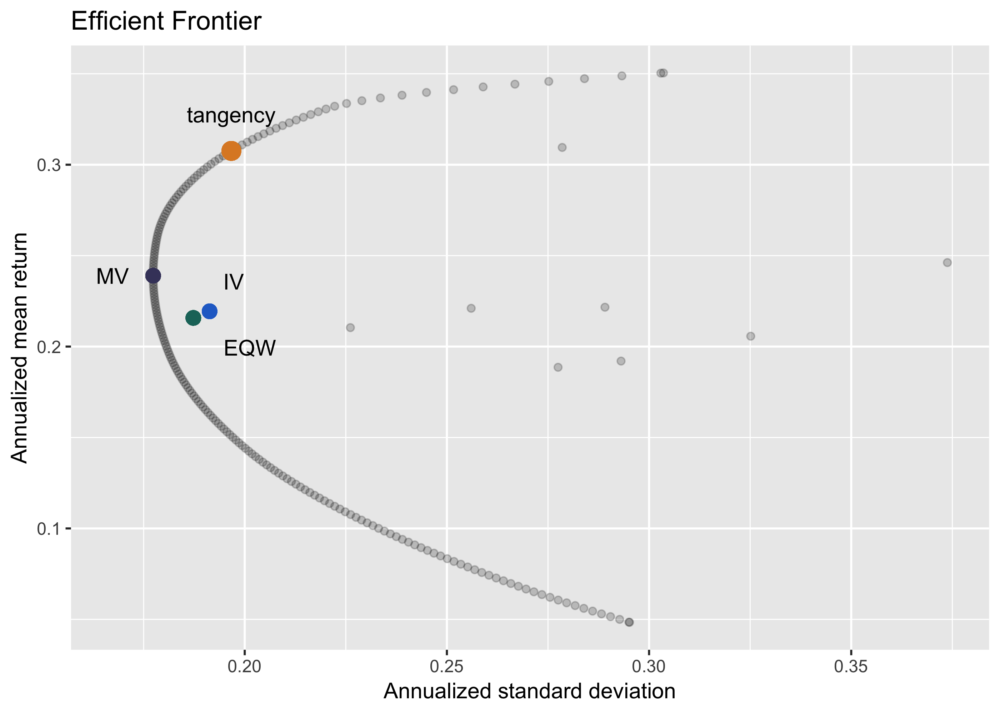

<!-- README.md is generated from README.Rmd. Please edit that file -->

# quantport

The package `quantport` provides routines to perform portfolio
optimization based on quadratic and sequential programming. With Sharpe
Ratio maximization problem (tangency portfolio), the lower boundary and
upper boundary for any single asset, as well as other constraints could
be implemented using Sequential Programming.

The main advantage of this package is easy-to-use and simplicity. The
package is based purely on functional programming. You do not need to
create object like S3 or S4 to run portfolio optimization. The result
from optimization will be stored in dataframe or list only. The mean
vector and the covariance matrix could be used from daily, monthly or
quarterly data. The package could be used in complement with your master
studies in portfolio optimization or courses such as CFA, FRM, etc.

# Plan for development

In the near future, we will add further functionalities including
Differential Evolutionary Optimization (DE) and Canonical
Black-Litterman model.

## Installation

There are several packages required: `quadprog`, `DEoptim`, `NlcOptim`,
`ggplot2` and `tidyverse`. We plan to submit this package to
[CRAN](https://CRAN.R-project.org) in the near future. At the mean time,
the package could be downloaded via github using `devtools`:

``` r
devtools::install_github("thanhuwe8/quantport")
```

## Example

This is a basic example which shows you how to solve the portfolio
optimization problem. We have the data in the form of data.frame with 10
assets monthly return as below:

``` r
library(quantport)
library(ggplot2)
data(dataset1)
head(dataset1,3)
#>         Date         FPT          GAS        GMD          VCB        VNM
#> 1 2013-02-28 -0.07713885  0.029228856  0.1640979 -0.014901543 0.01988566
#> 2 2013-03-29  0.02127660  0.163141994  0.3123053 -0.009184225 0.12624909
#> 3 2013-04-26 -0.01562500 -0.009350649 -0.2403561 -0.143402399 0.06881627
#>          REE         MSN          VIC         HPG         SSI
#> 1 0.01170047 -0.05879244  0.007751938 -0.02805611 -0.02709790
#> 2 0.00539707  0.10710275 -0.052403846  0.07422680 -0.03324349
#> 3 0.01073620 -0.12095854 -0.023338407  0.05758157 -0.02230483
```

Then we calculate 2 required inputs for portfolio optimization as
follows:

``` r
data_test <- dataset1[,-1]
mean_vec <- apply(data_test, MARGIN=2, mean)
cov_mat <- cov(data_test)
print(mean_vec);print(cov_mat)
#>         FPT         GAS         GMD         VCB         VNM         REE 
#> 0.017534864 0.020515421 0.017141368 0.018469602 0.018420805 0.015717528 
#>         MSN         VIC         HPG         SSI 
#> 0.004031204 0.025791474 0.029204277 0.016002170
#>             FPT         GAS         GMD         VCB         VNM
#> FPT 0.004261358 0.003310195 0.002141490 0.002445485 0.002023216
#> GAS 0.003310195 0.011642673 0.002543093 0.003547340 0.002224303
#> GMD 0.002141490 0.002543093 0.008809853 0.002653891 0.001893486
#> VCB 0.002445485 0.003547340 0.002653891 0.006964462 0.001944385
#> VNM 0.002023216 0.002224303 0.001893486 0.001944385 0.005461692
#> REE 0.003415528 0.002790504 0.003116219 0.002604268 0.002054255
#> MSN 0.002257804 0.004471736 0.002698520 0.003240405 0.001822089
#> VIC 0.002020248 0.002462625 0.001134478 0.002816980 0.001113102
#> HPG 0.002785511 0.004830655 0.002426015 0.002961944 0.001739557
#> SSI 0.003487514 0.003229850 0.002083359 0.003254615 0.001896067
#>             REE         MSN          VIC          HPG         SSI
#> FPT 0.003415528 0.002257804 0.0020202484 0.0027855106 0.003487514
#> GAS 0.002790504 0.004471736 0.0024626249 0.0048306552 0.003229850
#> GMD 0.003116219 0.002698520 0.0011344778 0.0024260148 0.002083359
#> VCB 0.002604268 0.003240405 0.0028169805 0.0029619435 0.003254615
#> VNM 0.002054255 0.001822089 0.0011131019 0.0017395569 0.001896067
#> REE 0.006416960 0.002017971 0.0018594194 0.0027919649 0.003851332
#> MSN 0.002017971 0.007260344 0.0022859130 0.0030889958 0.002974863
#> VIC 0.001859419 0.002285913 0.0064643146 0.0009621725 0.001700247
#> HPG 0.002791965 0.003088996 0.0009621725 0.0076790919 0.003463268
#> SSI 0.003851332 0.002974863 0.0017002472 0.0034632679 0.007157620
```

Then we provide some inputs to the `TangencyQP` to find the weight of
optimal portfolio with maximum Sharpe
Ratio.

``` r
tangency_result <- quantport::TangencyQP(mean_vec, cov_mat, short=TRUE, rf=0, "monthly") 
barplot(tangency_result$weight)
```


Portfolio return and standard deviation are also stored and accessed
using `$` operator

``` r
print(tangency_result$portfolioret)
#>           [,1]
#> [1,] 0.4095923
print(tangency_result$portfoliosd)
#>           [,1]
#> [1,] 0.2320305
print(tangency_result$SharpeRatio)
#>          [,1]
#> [1,] 1.765252
```

There are other useful functions you could find in the vignettes of this
package. Below is the efficient frontier with short-sale constraints.
The dots to the right of the curve is single asset risk-return trade-off
point. The red dot is tangency portfolio and the green dot is minimum
variance portfolio. Mean return and standard deviation are both
annualized assuming 252 trading
days.

``` r
ef <- quantport::showEfficient(mean_vec, cov_mat, F, 0.05, "monthly", 100, T) 
```


